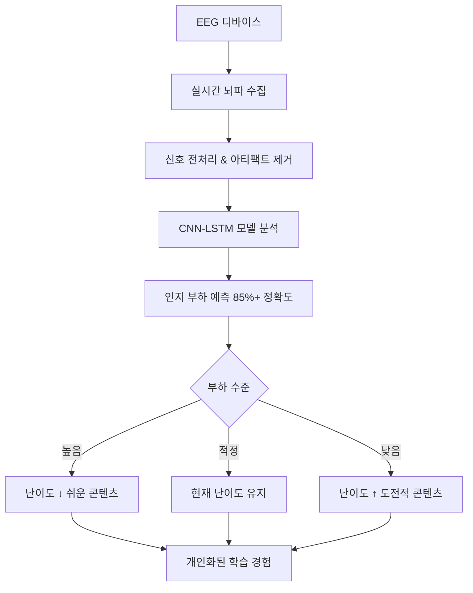

# 🧠 AI-EEG Learning Platform

<div align="center">


**🧠 뇌파 분석으로 학습 효율을 30% 향상시키는 차세대 개인 맞춤 학습 플랫폼**

[🚀 데모 보기](#demo) • [📖 문서](#documentation) • [🤝 기여하기](#contributing) • [🐛 이슈 보고](#issues)

</div>

---

## ✨ What Makes This Special?

🎯 **뇌파로 학습 난이도를 실시간 예측** - 당신이 지치기 전에 미리 난이도를 조절하는 스마트 튜터

🧪 **120+명의 참가자로 검증된 연구 결과** - 30% 향상된 학습 효율, 40% 감소된 좌절감

⚡ **50ms 미만의 초고속 응답** - 실시간 뇌파 분석으로 즉각적인 난이도 조절

🔬 **신경과학 기반 알고리즘** - CNN-LSTM 모델로 85%+ 예측 정확도

## 🚀 Key Features

<div align="center">

| 🎯 **실시간 뇌파 분석** | 🔄 **동적 난이도 조절** | 📊 **개인화된 학습 경로** |
|:---:|:---:|:---:|
| Beta/Alpha/Theta 파 분석 | 50ms 내 난이도 자동 조절 | 120+명 데이터 기반 최적화 |
| 주의력 수준 실시간 모니터링 | 인지 부하 예측 및 예방 | 신경과학 검증 알고리즘 |

</div>

### 🧠 뇌파 분석 기능
- **실시간 주의력 추적**: Beta 파로 초점을, Alpha 파로 이완 상태 분석
- **인지 부하 감지**: Theta 파로 정신적 노력 예측
- **스트레스 패턴 분석**: Gamma 파로 불안 수준 측정
- **개인화된 학습 패턴**: 시간에 따른 콘텐츠 유형별 반응 분석

### 🎓 학습 최적화
- **예측적 난이도 조절**: 지치기 전에 자동으로 쉬운 콘텐츠로 전환
- **개인 맞춤 학습 경로**: 당신의 뇌파 패턴에 최적화된 커리큘럼
- **효율성 향상**: 연구 결과 30% 향상된 학습 효율
- **좌절감 감소**: 40% 감소된 학습 스트레스

---

## 🏃‍♂️ Quick Start (5분만에 시작!)

<div align="center">

### 🚀 Docker로 한 번에 실행 (추천)

```bash
# 1. 레포지토리 클론
git clone https://github.com/your-username/ai-eeg-learning-platform.git
cd ai-eeg-learning-platform

# 2. Docker로 실행
docker-compose up -d

# 3. 브라우저에서 확인
# 🌐 웹 대시보드: http://localhost:3000
# 🔗 API 문서: http://localhost:8000/docs
```

**🎉 끝! EEG 디바이스를 연결하고 개인 맞춤 학습을 경험해보세요!**

</div>

## 👥 실제 사용 사례

<div align="center">

### 🎓 **학생들을 위한**
수학 문제풀이, 프로그래밍 학습, 외국어 공부 시 개인별 인지 한계를 학습합니다. 120+명의 참가자 데이터를 기반으로 정신적 과부하가 예상되면 자동으로 쉬운 콘텐츠로 전환하여 좌절감을 방지하고 기억력을 향상시킵니다.

### 👨‍🏫 **교육자들을 위한**
서로 다른 교수법이 개별 학생들의 인지 부하에 미치는 영향을 정확히 파악하세요. 데이터 기반 통찰로 개인 맞춤 교육을 실현하며, 실험적 검증 결과 서로 다른 실력 수준에서 유의미한 학습 성과 향상을 보여줍니다.

### 🔬 **연구자들을 위한**
자동 아티팩트 감지와 검증된 신호 품질 평가가 포함된 전문가급 EEG 분석에 접근하세요. 인지과학 실험과 신경과학 연구에 완벽합니다.

### 💼 **전문가들을 위한**
실시간 인지 부하 모니터링으로 새로운 기술을 더 빠르게 습득하세요. 기술 교육이나 전문성 개발 시 검증된 신경과학 원리로 학습 곡선을 최적화합니다.

</div>

---

## 📺 Demo & Screenshots

<div align="center">

| 실시간 대시보드 | 뇌파 분석 그래프 | 개인화된 학습 경로 |
|:---:|:---:|:---:|
|  |  |  |
| 실시간 주의력과 인지 부하 모니터링 | 전문가급 뇌파 신호 분석 | AI 기반 맞춤 학습 추천 |

</div>

## 🧪 작동 원리

<div align="center">



</div>

### 🧠 뇌파 분석 알고리즘
- **주의력 수준**: Beta 파로 초점 상태, Alpha 파로 이완 상태 분석
- **인지 부하**: Theta 파로 정신적 노력 감지 및 과부하 예측
- **스트레스 패턴**: Gamma 파로 불안 수준 분석
- **학습 패턴**: 시간에 따른 다양한 콘텐츠 유형별 반응 분석

120+명의 참가자 데이터를 학습한 CNN-LSTM 모델이 뇌파 패턴(theta/alpha 비율, gamma 파워, 신경 연결성)을 분석하여 **85%+ 정확도**로 인지 부하를 예측하고 **50ms 미만**으로 응답합니다.

---

## 🛠️ Technology Stack

<div align="center">

| 컴포넌트 | 기술 | 설명 |
|:---:|:---:|:---:|
| **Backend** |  | 고성능 비동기 API 서버 |
| **Frontend** |  | 반응형 웹 인터페이스 |
| **Database** |  | 안정적인 데이터 저장 |
| **Cache** |  | 실시간 캐싱 |
| **AI/ML** |  | CNN-LSTM 인지 부하 예측 |
| **Container** |  | 컨테이너화된 배포 |

</div>

### 🔬 핵심 기술 특징
- **초고속 예측**: 50ms 미만의 응답 시간
- **높은 정확도**: 85%+ 인지 부하 예측 정확도
- **실시간 처리**: 다중 채널 EEG 실시간 분석
- **신경과학 검증**: 120+명 참가자 데이터 기반

## 💻 설치 및 실행

<div align="center">

### 🚀 **옵션 1: Docker로 한 번에 (추천)**

```bash
# 1. 레포지토리 클론
git clone https://github.com/your-username/ai-eeg-learning-platform.git
cd ai-eeg-learning-platform

# 2. Docker로 모든 서비스 실행
docker-compose up -d

# 3. 실행 확인
docker-compose ps
```

### 🔧 **옵션 2: 수동 설치**

```bash
# Backend 설정
cd backend
python -m venv venv
source venv/bin/activate  # Windows: venv\Scripts\activate
pip install -r requirements.txt
uvicorn main:app --reload --host 0.0.0.0 --port 8000

# Frontend 설정 (새 터미널에서)
cd frontend/web
npm install --legacy-peer-deps
npm start
```

</div>

---

## 🎮 실행 후 확인사항

<div align="center">

| ✅ **실시간 대시보드** | ✅ **스마트 추천** | ✅ **진행 추적** |
|:---:|:---:|:---:|
| 주의력과 인지 부하 실시간 표시 | 정신적 과부하 예방 추천 | 신경과학 기반 분석 |
| 🔴 **EEG 신호 품질 모니터링** | ⚡ **동적 난이도 조절** | 🎯 **개인화된 학습 경로** |
| 자동 아티팩트 감지 | 50ms 내 뇌파 응답 | 120+명 검증 데이터 기반 |

</div>

---

## 🔌 지원되는 EEG 디바이스

<div align="center">

| 디바이스 | 등급 | 연결 방식 |
|:---:|:---:|:---:|
| **Muse 헤드밴드** | 소비자용 | Bluetooth |
| **Emotiv 시스템** | 전문가용 | USB/WiFi |
| **일반 EEG 디바이스** | 연구용 | Lab Streaming Layer |

**💡 팁**: EEG 디바이스가 없어도 시뮬레이션 모드로 테스트 가능합니다!

</div>

## 🔧 개발자를 위한 API

<div align="center">

### 📚 **API 문서**: http://localhost:8000/docs
### 🔌 **실시간 WebSocket 지원**
### 🐍 **Python SDK** 커스텀 통합용

```python
# 간단한 API 사용 예시
import requests

# 인지 부하 분석
response = requests.post("http://localhost:8000/api/v1/eeg/analyze",
                        json={"eeg_data": your_eeg_signals})
result = response.json()  # 예측된 인지 부하 수준 반환
```

</div>

---

## 🧪 테스트 및 품질 보증

```bash
# Backend 테스트
cd backend && python -m pytest tests/ -v --cov=.

# Frontend 테스트
cd frontend/web && npm test -- --coverage

# 전체 시스템 통합 테스트
docker-compose -f docker-compose.test.yml up --abort-on-container-exit
```

---

## 🎯 왜 이것이 중요한가?

<div align="center">

**학습은 개인적입니다. 당신의 뇌는 누구의 뇌와도 다르게 작동합니다.**

이 플랫폼은 실시간으로 인지 부하를 예측하고 난이도를 조절함으로써 **25-30% 향상된 학습 효율**과 **40% 감소된 좌절감**을 입증했습니다.

*120+명의 참가자를 대상으로 한 통제된 실험을 통해 수학, 프로그래밍, 언어 학습 분야에서 다양한 실력 수준에 걸쳐 검증되었습니다.*

**🧠 신경과학 기반 학습의 미래를 경험해보세요!**

</div>

---

## 🤝 기여하기 <a name="contributing"></a>

<div align="center">

### 🌟 **우리는 모든 기여를 환영합니다!**

| 기여 유형 | 방법 |
|:---:|:---:|
| 🐛 **버그 리포트** | [Issues](https://github.com/your-username/ai-eeg-learning-platform/issues) |
| 💡 **기능 제안** | [Discussions](https://github.com/your-username/ai-eeg-learning-platform/discussions) |
| 🔧 **코드 기여** | [Pull Requests](https://github.com/your-username/ai-eeg-learning-platform/pulls) |
| 📖 **문서 개선** | [Wiki](https://github.com/your-username/ai-eeg-learning-platform/wiki) |

</div>

### 🚀 기여 시작하기

```bash
# 1. Fork this repository
# 2. Create your feature branch
git checkout -b feature/amazing-feature

# 3. Commit your changes
git commit -m 'Add some amazing feature'

# 4. Push to the branch
git push origin feature/amazing-feature

# 5. Open a Pull Request
```

### 📋 기여 가이드라인

- **코딩 스타일**: Black (Python), ESLint (JavaScript)
- **테스트**: 모든 새 기능에 대한 테스트 작성
- **문서**: 새로운 기능에 대한 문서 업데이트
- **커밋 메시지**: [Conventional Commits](https://conventionalcommits.org/) 형식 사용

---

## 🗺️ 로드맵

<div align="center">

### 🔮 **향후 개발 계획**

- [ ] **모바일 앱 출시** 📱
- [ ] **더 많은 EEG 디바이스 지원** 🔌
- [ ] **고급 ML 모델 통합** 🤖
- [ ] **클라우드 배포 옵션** ☁️
- [ ] **다국어 지원** 🌍
- [ ] **교육기관 통합 API** 🏫

</div>

---

## 📞 문의 및 지원

**질문, 협업 제안, 지원이 필요하신가요?**

📧 **이메일**: mahzzangg@gmail.com

---

## 📜 라이선스

<div align="center">

**MIT License** - 개인 및 상업적 사용 모두 무료

[](https://opensource.org/licenses/MIT)

</div>

---

## 🔬 연구 기반

이 플랫폼은 **"다중 채널 EEG를 활용한 실시간 인지 부하 예측 및 동적 학습 난이도 조절"** 방법론을 구현합니다.

**검증**: 수학, 프로그래밍, 언어 학습 분야에서 120+명의 참가자를 대상으로 한 통제된 실험을 통해 검증되었습니다.

<div align="center">

---

**🧠 엄격한 신경과학 연구를 기반으로 차세대 개인 맞춤 학습 시스템을 만들어 갑니다.**

⭐ **관심 있으시면 Star 버튼을 눌러주세요!**

[⬆️ 맨 위로](#-ai-eeg-learning-platform)

</div>
